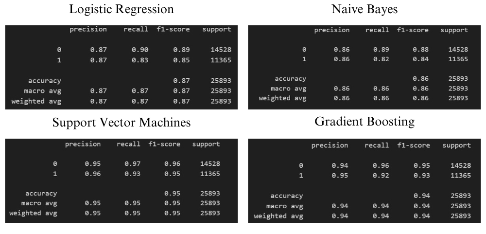
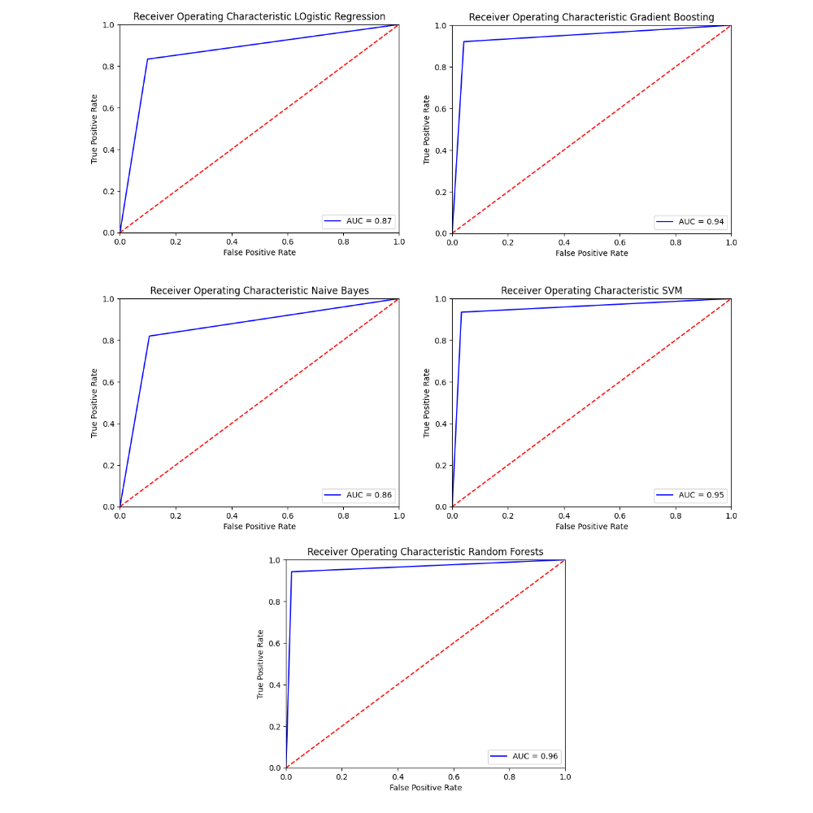

# ClientSatisfactionPrediction

* The full streamlit app is fully available on this link: https://clientsatisfactionprediction.streamlit.app/

---

## Table of Contents
- [Introduction](#introduction)
- [Project Overview](#project-overview)
- [Problem Statement](#problem-statement)
- [Project Scope](#project-scope)
- [Project Deliverables](#project-deliverables)
- [Demo Instructions](#demo-instructions)
- [Sample Data](#sample-data)
- [Metrics and Results](#metrics-and-results)
- [Outcomes](#outcomes)
- [Contact](#contact)

---

## Introduction

This is a Data Science project by Samia BELHADDAD, focused on predicting customer satisfaction. Effective anticipation of customer needs can significantly impact a business's success. This project utilizes data science techniques to predict customer satisfaction accurately, aiming to provide actionable insights for businesses.

---

## Project Overview

Companies that can effectively anticipate customer needs and tailor their services accordingly are more likely to thrive. This project focuses on leveraging data science techniques to predict customer satisfaction accurately. 4 distinct machine learning models were built to achieve this goal, aiming to provide businesses with actionable insights into improving customer experiences.

### Tools and Technology
- Python, Scikit Learn, Pandas, Numpy, Matplotlib, Seaborn
- Logistic Regression, Gradient Boosting, SVM, Naive Bayes
- Streamlit Web App
- Jupyter Notebook, Visual Studio Code, Git, GitHub

---

## Problem Statement

The problem at hand revolves around predicting customer satisfaction. Unhappy customers are more likely to switch to competitors, resulting in revenue loss and a tarnished reputation. Predictive models help anticipate whether a customer is likely to be satisfied or dissatisfied based on historical data, empowering businesses to proactively address issues and enhance customer satisfaction.

---

## Project Scope

The scope of this project encompassed the following key aspects:

- Data Collection: Gathering and preprocessing customer-related data, including purchase history, customer demographics, and feedback.
- Exploratory Data Analysis (EDA): Investigating data patterns and identifying key features that influence customer satisfaction.
- Feature Engineering: Creating relevant features to enhance model performance.
- Model Selection: Choosing Four 
machine learning models suitable for customer satisfaction prediction.
- Model Training: Optimizing and fine-tuning each selected model.
- Model Evaluation: Assessing model performance using metrics such as accuracy, F1-score, and ROC-AUC.
- Deliverable Creation: Generating a detailed report, codebase, and interactive demo for showcasing the project's outcomes.

---

## Project Deliverables

- A well-documented Python codebase hosted on GitHub, demonstrating data preprocessing, model training, and evaluation.
- An interactive web-based demo allowing users to input customer data and receive satisfaction predictions.
- Predictive machine learning models capable of estimating the likelihood of customer enrollment.
- Insights into key factors influencing customer decisions through feature importance analysis.
- Real-time integration of the predictive model into a Streamlit Web app to be used internally.

---

## Demo Instructions

You can try the app using the Streamlit view from [here](https://premiumenrollment.streamlit.app/).

---

## Sample Data

This is a sample of the used dataset. [Dataset](https://your-website.com/dataset-link)

Data has 22 features and a target feature. The dataset represents user demographics, user interaction with the app features, user engagement within the premium features, and user subscription to the premium service.

---

## Metrics and Results

Developed and fine-tuned four machine learning models for customer satisfaction prediction. Achieved the following accuracies on the test dataset, demonstrating the effectiveness of the predictive models. Identified key features that significantly influence customer satisfaction, providing actionable insights for businesses.

The metrics used for evaluation are:
- Accuracy
- Precision and Recall
- ROC AUC Curves
- F1 Score

Achieved the following metrics on the test dataset:

<h3 align="center">Classification Report</h3>

  

<h3 align="center">AUC ROC Curves</h3>

  

These results demonstrate the effectiveness of the predictive models. Identified key features that significantly influence customer satisfaction, providing actionable insights for businesses.

---

## Outcomes

- Precise marketing campaigns and ads targeting with accurate focus on potential premium clients.
- Improved marketing strategies and enhanced campaign effectiveness.
- Real-time decision support with instant data-driven decision-making.
- Identifying dissatisfied customers early in their journey.
- Anticipating customer needs and providing exceptional service.

---

#### Instructions to Try the Project:

* Clone Repo:
~~~ 
git clone https://github.com/Hypatchia/ClientSatisfactionPrediction
~~~

* Navigate to Repo's directory
~~~
cd PremiumEnrollementPrediction
~~~
* Create virtual environment
~~~
python -m venv myenv
~~~

* Activate venv
~~~
source <path_to_environmeent>/myenv/activate
~~~
* Install requirements.txt
~~~
pip install -r requirements.txt
~~~

* Run Streamlit Server:
~~~
streamlit run app.py
~~~

* Navigate to saved_models
- Copy and past All .pkl saved model to root directory (where app.py is)
* Navigate to Processed_dataset
- Upload the test_data.csv to app.

## Contact
 Feel free to reach out to me on LinkedIn or through email & don't forget to visit my portfolio.
 

